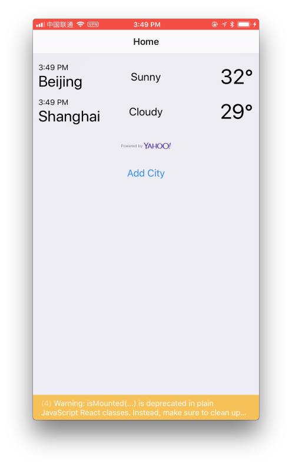

# WeatherAwesome ☁️☔️⚡️❄️

## Setup

1. Become a Google Developer: https://developers.google.com
1. Register a Google Maps key: https://developers.google.com/places/web-service/get-api-key#get_an_api_key
1. Create a `.credentials.js` in project root.

```js
export default {
  google: 'YOUR_KEY',
};
```

## Screenshots

<a href="https://www.youtube.com/watch?v=2uzN4u_FWGA&feature=youtu.be">

</a>
